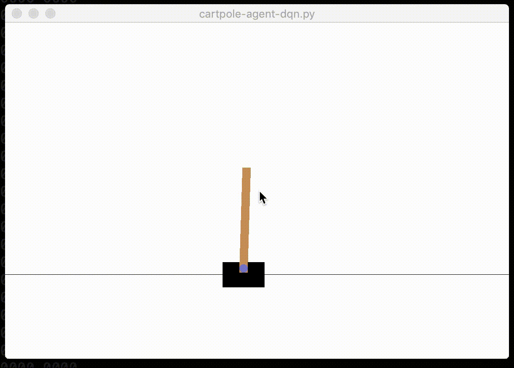

# Cartpole Solver

This project is aimed to solve the Cartpole-v0 environment in OpenAI Gym. The task is to balance a pole that is mounted on a cart by moving the cart left/right.

The agent is rewarded **+1** for every second of *Not falling*!
The pole is considering to have fallen if the angle of the pole increases above 12 degrees.

The Task is assumed to be solved if the pole is balanced until the total reward reaches 200.

